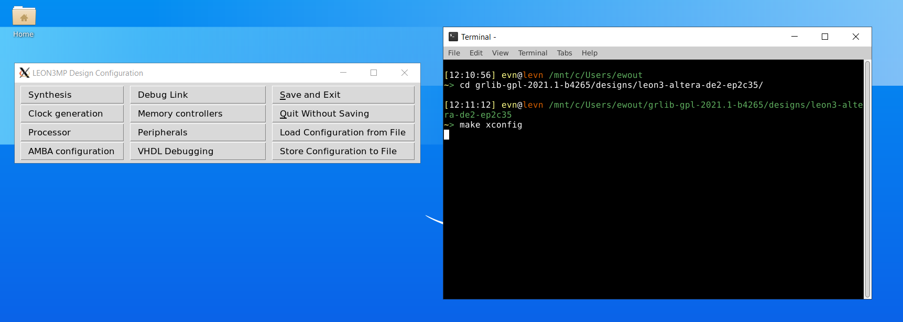
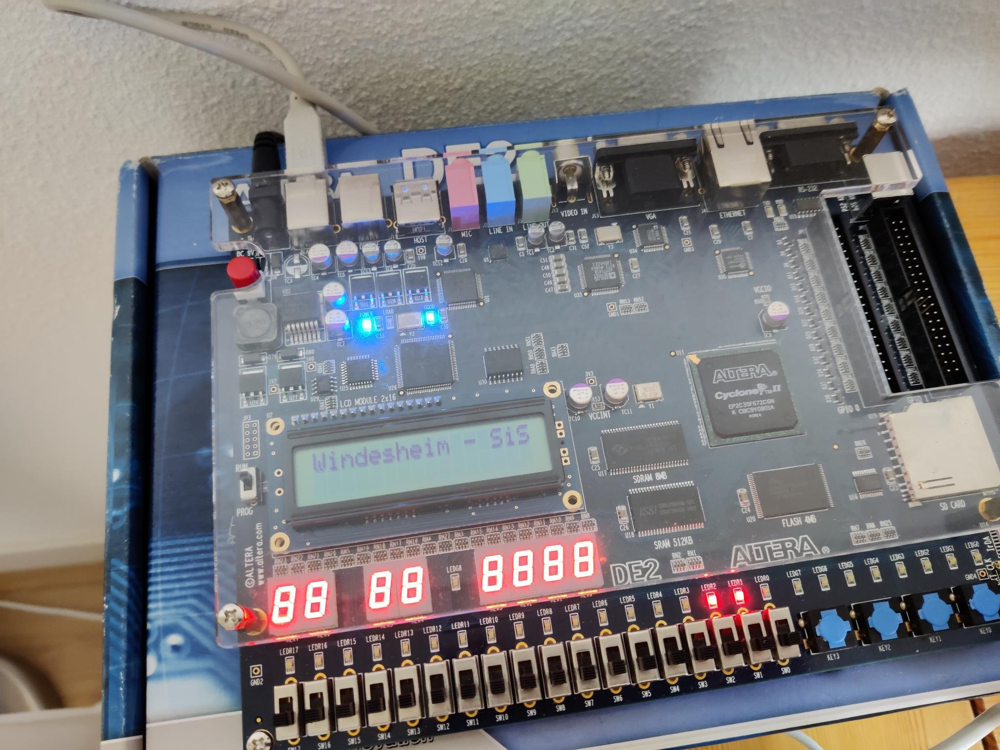

# Leon3 development

Author: Ewout van Nimwegen

Date of creation: 17 May 2021

Download the GRLIB package and extract it,
I'm using grlib-gpl-2021.1-b4265 and the Altera DE2 (cyclone II) board.
This board is kinda oldso I had to install various old 32-bit libraries to even
start quartus prime. The command line utilities offer much better support
over time then GUI's, because they rely on less 3th party libaries.

```console
PC $ tar xvf grlib-com-<version>.tar.gz
```

Set the environment variables.

```console
PC $ export GRLIB /home/user/grlib-com-<version>
PC $ export QUARTUS_ROOTDIR=altera/quartus<version>/quartus/
```

or even better add the following to your ~/.bashrc file

```bash
export ALTERAPATH=/mnt/c/altera/13.0sp1
export QUARTUS_ROOTDIR=$ALTERAPATH/quartus
export PATH=$PATH:${ALTERAPATH}/quartus/bin
export PATH=$PATH:${ALTERAPATH}/nios2esd/bin

export GRLIB=/mnt/c/Users/ewout/grlib-gpl-2021.1-b4265
```

Then run the install-altera command and compile the source code for the DE2.
Luckly we can program the FPGA inside the shell, no gui's allowed here.

```console
PC $ cd ~/grlib-com-<version>
PC $ make install-altera
```

```console
PC $ cd ~/grlib-com<version>/designs/<board>
PC $ make quartus
PC $ make quartus-prog-fpga
```

If these green lines pop up your good to go.

```console
Info: Command: quartus_pgm -c USB-Blaster -m JTAG -o p;leon3mp_quartus.sof
Info (213045): Using programming cable "USB-Blaster [1-2]"
Info (213011): Using programming file leon3mp_quartus.sof with checksum 0x00D82176 for device EP2C35F672@1
Info (209060): Started Programmer operation at Mon May 17 15:43:49 2021
Info (209016): Configuring device index 1
Info (209017): Device 1 contains JTAG ID code 0x020B40DD
Info (209007): Configuration succeeded -- 1 device(s) configured
Info (209011): Successfully performed operation(s)
Info (209061): Ended Programmer operation at Mon May 17 15:43:51 2021
Info: Quartus II 32-bit Programmer was successful. 0 errors, 0 warnings
    Info: Peak virtual memory: 127 megabytes
    Info: Processing ended: Mon May 17 15:43:51 2021
    Info: Elapsed time: 00:00:02
    Info: Total CPU time (on all processors): 00:00:00
```

The hardware configuration is implemented now it is time to write a small
hello world program in C.

```c
#include <stdio.h>

int main() {
    puts("Leon(idas) the great");
}
```

Compile the program with:

```console
PC $ sparc-gaisler-elf-gcc.exe -mcpu=leon3 -o hello hello.c
```

## GRMON3 flasher & debugger

At first I tried to use grmon3 on Linux, but it seemed impossible to get it to work.
I received this error every time I ran the altera jtag command.

```console
JTAG chain (1): EP2C35
ERROR! AMBA plug&play not found!
Failed to initialize target!
```

After my forum post Arvid explained the following:

<i>The Altera Blaster JTAG is only supported by the 32-bit version, this is
mentioned in the manual. And evaluation version is only available as 64-bit.</i>

<i>However it seems like you managed to connect on Windows, so it?s possible
that the 64-bit works on that platform (I don?t remember if I have tested the
64-bit version using the Blaster JTAG on Windows, and I don?t have access to any
system to test it at the moment).
The message that it requires a PRO version is bug that is related to this
particular template design. I have made a new release of the GRMON evaluation
version (3.2.12.1) that fixes it.</i>

Luckly I had a Windows 10 box available and it worked perfectly with:

```console
PC $ .\grmon.exe -altjtag -u
```

The -altjtag flag allows us to use the Altera JTAG and the -u flag forwards the
local FPGA console to this workstation. Load the program to the FPGA then start it with the run command.

```console
GRMON3 $ load hello
GRMON3 $ run
```

Great it works!

```console
grmon3> run
Leon(idas) the great

  Program exited normally
```

Developing on Windows requires a few extra tools:

- WSL2 (I'm using Ubuntu 20.04)
- VcxSrv

I decided to use the XFCE GUI to get access to the xconfig tool.
Add these lines to the ~/.bashrc file.

```bash
# Get the IP Address of the Windows 10 Host and use it in Environment.
export DISPLAY=$(grep -m 1 nameserver /etc/resolv.conf | awk '{print $2}'):0
export LIBGL_ALWAYS_INDIRECT=1
```

[](xfce.webp)

## Debugging

Compile the program with the -g flag to enable debugging.
Then restart the grmon3 debugger and load the program.
Place a breakpoint on the main() line and start the program.

```console
GRMON3 $ bp main
GRMON3 $ run
```

```
grmon3> run
  Breakpoint 1 hit
  0x4000124c: b0102000  mov  0, %i0  <main+4>
```

Use the step command to step through the code and use the reg command to view registers.

```console
grmon3> cont
Leon(idas) the great

  Program exited normally
```

## Blinky LED

Another fun example is the blinky LED.
The example below shows how we can modify the gpio_0 register which is available
within the default de2 example of grlib. I remapped GPIO_0[0] (PIN_D25) to LEDR[2] (PIN_AB21).
Recompile the VHDL code and reprogram the FPGA. Then upload the C code below. This code
defines all io of gpio0 as outputs and sets them to high.
The range of the IO register is available in the IP cores manual.

```c
#include <stdlib.h>
#include <stdio.h>

int main(void){
    unsigned int *gpio0_base = (int *) 0x80000900;
    unsigned int *gpio0_out = (int *) 0x80000904;
    unsigned int *gpio0_dir = (int *) 0x80000908;

    *gpio0_dir = 0x0000003F; // Output
    *gpio0_out = 0x0000003F; // Set LEDs
    return EXIT_SUCCESS;
}
```

[](fpga.webp)

## What's next

Unfortunately it isn't possible to run Linux on this FPGA, because Linux requires 32MiB RAM and the DE2 has 8M-byte : (

This board hasn't enough resources to function like a MPU but it could easily run a RTOS. I'm about to try the Zephyr OS
on this board and I might write another post about it.

## Fixes

Fix for Quartus prime libpng12 launch error (Linux)

```console
PC $ echo "deb http://mirrors.kernel.org/ubuntu/ xenial main" | sudo tee -a /etc/apt/sources.list && sudo apt-get update && sudo apt install -y --allow-unauthenticated libpng12-0
```

## Sources

- [Debugger](https://www.gaisler.com/index.php/downloads/debug-tools?task=view&id=190)
- [Xilinx guide](https://www.thanassis.space/myowncpu.html)
- [grmon3 fix](https://discourse.grlib.community/t/grmon3-altera-jtag-debugging-error/128)
